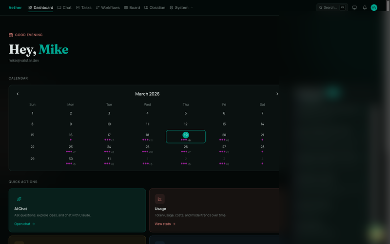
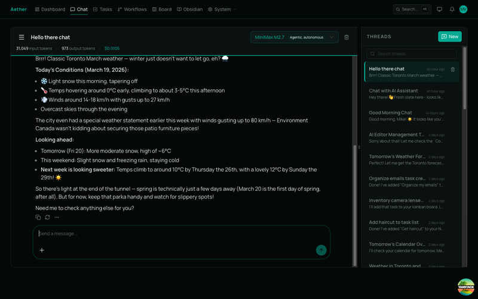
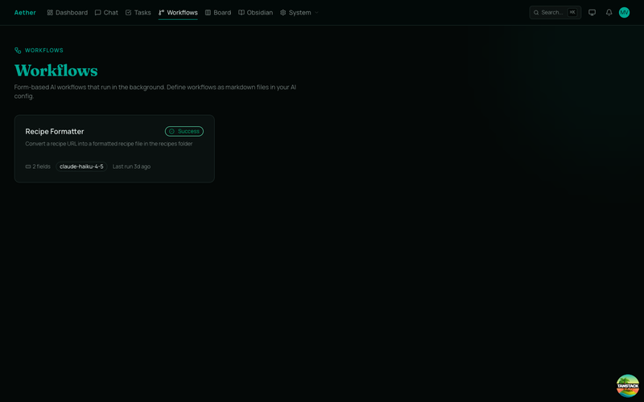
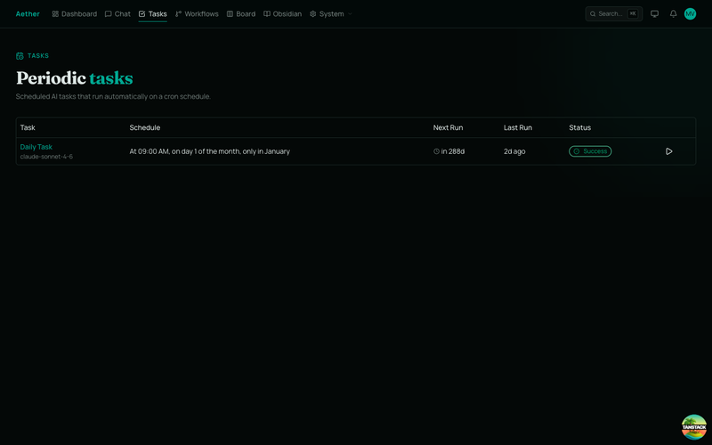
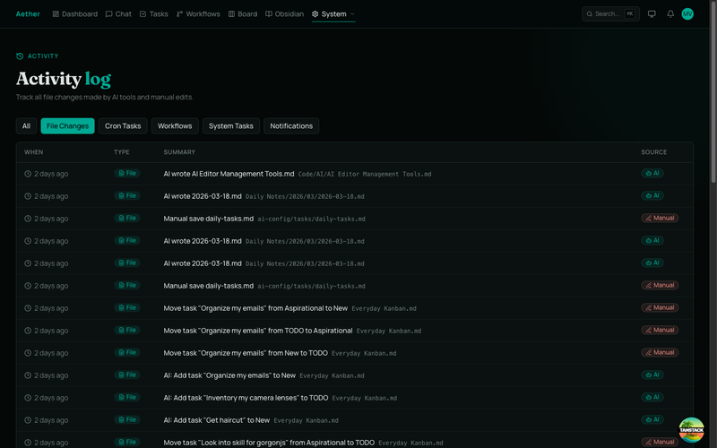
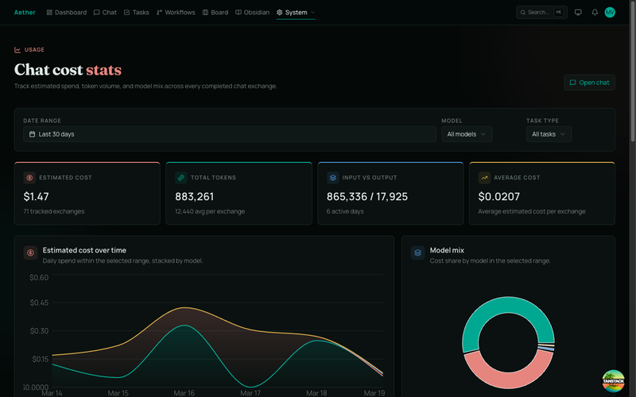

# Aether

A self-hosted personal dashboard and AI agent platform, backed by your [Obsidian](https://obsidian.md/) vault. Chat with Claude, automate recurring tasks, run form-driven workflows, manage a kanban board, and track everything — all from a single interface that keeps your data local.

<a href="docs/screenshots/full/dashboard.png"></a>

## Features

### AI Chat
Multi-turn conversations with Claude (Haiku 4.5, Sonnet 4.6, Opus 4.6) plus OpenRouter models. The AI has full tool access — it can search the web, read and write files in your Obsidian vault, manage your kanban board, query your calendar, and send you push notifications. Streaming responses, message editing, branch navigation, and auto-generated thread titles.

<a href="docs/screenshots/full/chat.png"></a>

### Workflows
Define form-based AI workflows as markdown files in your Obsidian vault. Each workflow has typed input fields (text, URL, select, etc.) and runs in the background with full tool access. Results are viewable in-app and can be continued as chat threads.

<a href="docs/screenshots/full/workflows.png"></a>

### Periodic Tasks
Cron-scheduled AI tasks defined as markdown config. Set a schedule, pick a model, and Aether runs it automatically — useful for daily summaries, recurring file processing, or anything you'd otherwise do manually. Tracks run history, token usage, and cost per execution.

<a href="docs/screenshots/full/tasks.png"></a>

### Obsidian Integration
Your Obsidian vault is the source of truth. Aether reads AI config, system prompts, task definitions, and workflow specs from markdown files in your vault. The AI can browse, search, read, write, and edit any file in the vault — turning your notes into a living knowledge base the AI can act on.

### Kanban Board
A drag-and-drop task board synced to an Obsidian Kanban file. Move tasks between columns in the UI and they persist back to your vault. The AI can also manage board tasks as a tool during conversations.

### Activity Log
Track every change the AI makes — file edits, task runs, workflow executions, and system events. Inspect diffs and revert file changes when needed.

<a href="docs/screenshots/full/activity.png"></a>

### Usage & Cost Tracking
Real-time token usage and cost estimation across all AI interactions. Visualize daily spend, model mix, and token flow with interactive charts. Filter by date range, model, or task type.

<a href="docs/screenshots/full/usage.png"></a>

### Calendar Integration
Connect iCal feeds to see upcoming events on your dashboard. The AI can query your calendar during conversations.

### Notifications
In-app notification system with optional [Pushover](https://pushover.net/) integration for mobile push notifications. The AI can send you notifications as a tool — useful for task completions or alerts from periodic jobs.

### Command Palette
Keyboard-first navigation with `Cmd+K` to jump to any page or action.

## AI Tool Access

During chat, workflows, and periodic tasks, the AI has access to:

| Tool | Description |
|------|-------------|
| **Web Search & Fetch** | Search the web and fetch pages as clean markdown |
| **Obsidian Vault** | Read, write, edit, search, and browse vault files |
| **Kanban Board** | List, add, update, and move tasks |
| **Calendar** | Query upcoming events from connected iCal feeds |
| **Notifications** | Send in-app and push notifications |
| **AI Memory** | Read and write to a structured memory folder in your vault |

## Tech Stack

- **Framework**: [TanStack Start](https://tanstack.com/start) (SSR/streaming on Vite)
- **Database**: SQLite via [Prisma](https://www.prisma.io/) (zero external dependencies)
- **AI**: [Vercel AI SDK](https://sdk.vercel.ai/) + [Anthropic Claude](https://www.anthropic.com/) + [OpenRouter](https://openrouter.ai/)
- **UI**: [Shadcn](https://ui.shadcn.com/) + [Tailwind CSS v4](https://tailwindcss.com/) + [Assistant UI](https://www.assistant-ui.com/)
- **Auth**: [Better Auth](https://www.better-auth.com/) (invite-only, email/password)
- **State**: Jotai + Zustand
- **Scheduling**: Croner for cron task execution
- **Logging**: Pino with daily rotation

## Getting Started

### Prerequisites

- Node.js 20+
- [pnpm](https://pnpm.io/)
- An [Anthropic API key](https://console.anthropic.com/api-keys)
- An [Obsidian](https://obsidian.md/) vault (optional but recommended)

### Setup

```bash
pnpm install
cp .env.example .env        # fill in your API keys and vault path
pnpm db:generate
pnpm db:push
pnpm ai-config:seed         # seed AI prompts into your Obsidian vault
pnpm dev                    # starts on port 3000
```

### First Admin Account

Authentication is invite-only. Create the first admin from the CLI:

```bash
pnpm create:first-admin
```

Then sign in and create additional accounts from `/users`.

### Obsidian Integration

Point Aether at your vault by setting these in `.env`:

```
OBSIDIAN_DIR=/path/to/your/vault
OBSIDIAN_AI_CONFIG=AI Config        # folder for AI config files
OBSIDIAN_AI_MEMORY=AI Memory        # folder for AI memory notes
```

Seed initial config files into the vault:

```bash
pnpm ai-config:seed
```

Task definitions, workflow specs, and system prompts are all markdown files in your vault — edit them in Obsidian and Aether picks up changes automatically.

## Development

```bash
pnpm dev              # Dev server (port 3000)
pnpm build            # Production build
pnpm test             # Run tests (Vitest)
pnpm check            # Lint + format (Biome)
pnpm type-check       # TypeScript type checking
pnpm db:studio        # Browse database in Prisma Studio
pnpm storybook        # Component library (port 6006)
```

## License

[MIT](LICENSE)
